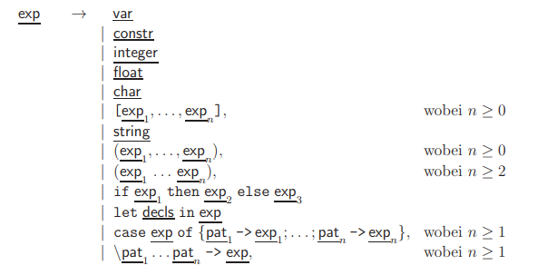

# Chapter 1: Introduction to the Functional Programming Language Haskell

## 1.1 Basic Language Constructs

In this section, we introduce the basic language constructs of Haskell (declarations, expressions, patterns, and types).

### 1.1.2 Expressions

Expressions $\underline{\text{exp}}$ are the central concept of functional programming. An expression describes a value (e.g. a number, a letter or a function). The input of an expression into the interpreter causes its evaluation. In addition, each expression has a type. When "`:t` $\underline{\text{exp}}$"is entered in the (interactive mode of) GHC, the type of $\underline{\text{exp}}$ is calculated and output. When evaluating an expression, it is also first checked whether the expression is correctly typed and only in case of success the evaluation is actually performed. An expression $\underline{\text{exp}}$ can have the following form:

* $\underline{\text{var}}$: Variable identifiers like `x` are expressions. As mentioned, variable identifiers in Haskell are formed by strings starting with a lowercase letter.

* $\underline{\text{constr}}$: Another possibility for expressions are data constructors. Data constructors are used to construct objects of a data structure and are introduced during the data type definition. In Haskell, identifiers for data constructors are formed by strings that begin with uppercase letters. Examples are the data constructors `True` and `False` of the predefined data structure `Bool`. Another example are the data constructors `[]` and `:` for the predefined data structure of lists.

* $\underline{\text{integer}}$: Also the integers `0, 1, -1, 2, -2, ...` are expressions.

* $\underline{\text{float}}$: Floating point numbers like `-2.5` or `3.4e+23` are also expressions.

* $\underline{\text{char}}$: Other expressions are `a,...,z,A,...,Z,0,...,9` as well as the space character `' '` and non-printable control characters like `\n` for the end-of-line character. All these characters are evaluated to themselves (in apostrophes (quotes)).

* $[\underline{\text{exp}}_1, \ldots, \underline{\text{exp}}_n], \text{ where } n \geq 0$: Such an expression denotes a list of `n` expressions. As mentioned, `[]` represents the empty list and `[0,1,2,3]` is an abbreviation for `0 : 1 : 2 : 3 : []`, where `:` associates to the right. All elements of a list must have the same type. For example, the type of the above list would be `[Int]`, i.e. the type of lists of integers.

* $\underline{\text{string}}$: A $\underline{\text{string}}$ is a list of characters $\underline{\text{char}}$ (i.e., it is an expression of type `[Char]`). Instead of `['h','e','l','l','o']` one often writes `"hello"`. Such a string is evaluated to itself. The predefined type `String` in Haskell is identical with the type `[Char]`.

* $(\underline{\text{exp}}_1, \ldots, \underline{\text{exp}}_n), \text{ where } n \geq 0$: This is a tuple of expressions. Unlike the list, the expressions in a tuple can be of different types. An example would be the expression `(10, False)`. This expression would have the type `(Int, Bool)`. One-element tuples ($\underline{\text{exp}}$) are evaluated to $\underline{\text{exp}}$. Zero-element tuples `()` have the special type `()`.

* $(\underline{\text{exp}}_1, \ldots, \underline{\text{exp}}_n), \text{ where } n \geq 2$: Such an expression stands for the function application of expressions. Here we omit the parenthesis as far as possible. The function application has the highest binding priority and associates to the left. Examples for such expressions are `square 10` (of type `Int`) or `plus 5 3` (also of type `Int`) or `plus 5` (of type `Int -> Int`). So the value of an expression can be a function again.

* $\texttt{if} \text{ } \underline{\text{exp}}_1 \text{ } \texttt{then} \text{ } \underline{\text{exp}}_2 \text{ } \texttt{else} \text{ } \underline{\text{exp}}_3$: Here $\underline{\text{exp}}_1$ must be of type `Bool` and $\underline{\text{exp}}_2$ and $\underline{\text{exp}}_3$ must be of the same type. During the evaluation, the value of $\underline{\text{exp}}_1$ is determined first and then, depending on this value, the value of $\underline{\text{exp}}_2$ or $\underline{\text{exp}}_3$. Instead of

```haskell
maxi(x, y) | x >= y    = x
           | otherwise = y
```

one can therefore also write the following:

```haskell
maxi(x, y) = if x >= y then x else y
```

* $\texttt{let} \text{ } \underline{\text{decls}} \text{ } \texttt{in} \text{ } \underline{\text{exp}}$: In this expression a local declaration sequence $\underline{\text{decls}}$ is defined for the expression $\underline{\text{exp}}$. This is analogous to the local declaration using $\texttt{where}$, except now the local declaration is prefixed instead of suffixed. Instead of

```haskell
roots a b c = ((-b - d)/e, (-b + d)/e)
              where d = sqrt (b*b - 4*a*c)
                    e = 2*a
```

you can therefore also write the following:

```haskell
roots a b c = let d = sqrt (b*b - 4*a*c)
                  e = 2*a
              in ((-b - d)/e, (-b + d)/e)
```

* $\texttt{case } \underline{\text{exp}} \texttt{ of } \{ \underline{\text{pat}}_1 \rightarrow \underline{\text{exp}}_1 ; \ldots ; \underline{\text{pat}}_n \rightarrow \underline{\text{exp}}_n \}, \text{ where } n \geq 1$: When evaluating this expression, an attempt is made to match the pattern $\underline{\text{pat}}_1$ to the expression $\underline{\text{exp}}$. If this succeeds, the result is the expression $\underline{\text{exp}}_1$ , where the variables are instantiated with the matching substitution used. Otherwise, an attempt is then made to match the pattern $\underline{\text{pat}}_2$ to $\underline{\text{exp}}$, and so on. Here again the offside rule for notation can be used. Instead of

```haskell
und True  y = y
und False y = False
```

you can therefore also write the following:

```haskell
und x y = case x
            of True  -> y
               False -> False
```

Moreover, instead of the expressions $\underline{\text{exp}}_i$ one can also use sequences of conditional expressions $\texttt{| } \underline{\text{exp}} \rightarrow \underline{\text{exp}}$ and, in addition, in each alternative of the `case` expressions, it is possible to match local declarations with `where`.

* $\ \underline{\text{pat}}_1 \ldots \underline{\text{pat}}_n \rightarrow \underline{\text{exp}}, \text{ where } n \geq 1$: Such an expression is called a "lambda expression" or "lambda abstraction" because the character `\` (backslash) represents the Greek letter $\lambda$. The value of this expression is the function that takes the arguments $underline{\text{pat}}_1 \ldots \underline{\text{pat}}_n$ to $\underline{\text{exp}}$. For example, `\x -> 2 * x` is the function that takes an argument and doubles it. Its type is `Int -> Int`. Thus, "lambda" is used to form so-called "unnamed/anonymous functions" that can only be used at the point of their definition. The expression

```haskell
(\x -> 2 * x) 5
```

therefore evaluates to $10$. The function `\x y -> x + y` is the addition function of the type `Int -> Int -> Int`. In general, the expression $\ \underline{\text{pat}}_1 \ldots \underline{\text{pat}}_n \rightarrow \underline{\text{exp}}$ has the type $\underline{\text{type}}_1 \rightarrow \ldots \rightarrow \underline{\text{type}}_n \rightarrow \underline{\text{type}}$, if $\underline{\text{pat}}_i$ has the type $\underline{\text{type}}_i$ and $\underline{\text{exp}}$ has the type $\underline{\text{type}}$, respectively. For lambda expressions, arbitrary patterns are possible, i.e., one can also form expressions like `\(x, y) -> x + y` of type `(Int, Int) -> Int`. The lambda expressions show that functions in functional programming languages are really equal data objects, because they can now be completely described by suitable expressions.

Instead of the function declaration

```haskell
plus x y = x + y
```

you can also write

```haskell
plus = \x y -> x + y
```

or

```haskell
plus x = \y -> x + y
```

can also be defined.

#### Summary of Syntax for Expressions

In summary, the following are the grammar syntax rules for expressions in Haskell:



$\underline{\text{constr}} \rightarrow$ String of letters and numbers with capital letters at the beginning.
