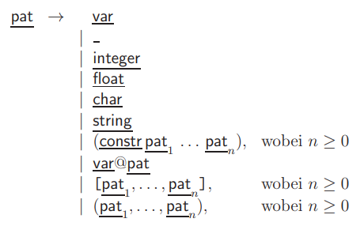

# Chapter 1: Introduction to the Functional Programming Language Haskell

## 1.1 Basic Language Constructs

In this section, we introduce the basic language constructs of Haskell (declarations, expressions, patterns, and types).

### 1.1.3 Patterns

In the function declaration, the so-called "patterns" are specified for the arguments. They restrict the form of the allowed arguments. They restrict the form of the allowed arguments. The syntax of patterns is therefore similar to the syntax of expressions, because patterns are prototypes for the expected values. The form of the values is described by the occurring data constructors, where instead of some partial values there are variables in the pattern (so now we use data constructors to decompose objects instead of constructing them). A pattern matches an expression (or it matches this expression) if this expression emerges from the pattern when the variables are replaced by other partial expressions. As an example we had already considered the algorithms and, len and second in Section $1.1.1$.

As another example, consider the algorithm `append`. (An analogous (infix)- function `++` (on lists with elements of arbitrary type) is predefined in Haskell).

```haskell
append :: [Int]  -> [Int] -> [Int]
append []     ys = ys
append (x:xs) ys = x : append xs ys
```

To compute `len (append [1] [2])`, the argument `append [1] [2]` of `len` is evaluated only until one can decide which pattern in the definition of `len` matches. So here one evaluated the argument only to `1:append [] [2]`. At this point it is already clear that only the second equation of len is usable and one gets `1 + len (append [] [2])`, which is then further evaluated. If it is not possible to determine whether the pattern under consideration matches without evaluating the argument, the argument expression is first evaluated only until the outermost constructor of the argument is determined. (This is called Weak Head Normal Form, cf./compare with Chapter 3.) Then one can check whether this constructor matches the outermost constructor of the pattern. If necessary, another recursive call of the pattern matching procedure for the partial arguments can be made.

For example, consider the following definitions.

```haskell
zeros :: [Int]
zeros = 0 : zeros

f :: [Int] -> [Int] -> [Int]
f [] ys = []
f xs [] = []
```

The evaluation of `f [] zeros` terminates, although `zeros` by itself does not terminate. The reason is that no evaluation of `zeros` is necessary to find out that the first equation of `f` is applicable. But also `f zeros []` terminates. Here `zeros` is first evaluated in one step to `0 : zeros`. Now the outermost constructor `:` of `f`'s first argument is fixed. Since this constructor is different from the constructor `[]`, the first equation cannot be applicable and therefore the second equation is used.

An example of the use of pattern matching in pattern declarations is

```haskell
let x:xs = [1,2,3] in xs
```

Here `x:xs` is a pattern matched on the expression `[1,2,3]`. The matching is successful on the substitution `[ x/1, xs/[2,3] ]`. The expression above is therefore evaluated to [2,3].

One restriction on patterns is that they must be linear, i.e., no variable may occur more than once in a pattern. The reason for this is that otherwise not all evaluation strategies would give the same result. For example, one could then declare the following function.

```haskell
equal :: [Int] -> [Int] -> Bool
equal xs xs     = True
equal xs (x:xs) = False
```

The expression `equal zeros zeros` could now be evaluated to both `True` and `False` depending on the evaluation strategy. In general, a pattern $\underline{\text{pat}}$ can have the following forms:

* $\underline{\text{var}}$: Each variable identifier is also a pattern. This pattern matches any value, binding the variable to that value when matching. An example of a function declaration where such a pattern is used is

```haskell
square x = x * x
```

* `_`: The underscore character `_` is the wildcard (joker) pattern. It also matches any value, but there is no variable binding. The joker `_` may therefore occur several times in a pattern. For example, the function `and` can also be defined as follows:

```haskell
und True y = y
und _ _    = False
```

* $\underline{\text{integer}}$ or $\underline{\text{float}}$ or $\underline{\text{char}}$ or $\underline{\text{string}}$: These patterns only match themselves and there is no variable binding during matching.

* $(\underline{\text{constr}} \text{ } \underline{\text{pat}}_1 \ldots \underline{\text{pat}}_n), \text{where } n \geq 0$: Here `constr` is an $n$-character data constructor. This pattern matches values formed with the same data constructor if each $\underline{\text{pat}}_i$ matches the $i$-th argument of the value. We have seen examples of this in the declaration of the algorithms `and`, `len` and `append`. (Here `:` is an infix constructor, so it is not on the outside. (You can also write `((:) x xs)` instead). As usual, we omit parentheses where possible to improve readability.

* $\underline{\text{var}}@\underline{\text{pat}}$: This pattern behaves like $\underline{\text{pat}}$, but if $\underline{\text{pat}}$ matches the expression to be matched, the variable $\underline{\text{var}}$ is additionally bound to the entire expression. As an example, consider the following function that copies the first element of a list.

```haskell
f [] = []
f (x : xs) = x : x : xs
```

So now, instead of the second defining equation, one could also use the following equation.

```haskell
f y@(x : xs) = x : y
```

* $[\underline{\text{pat}}_1, \ldots, \underline{\text{pat}}_n], \text{ where } n \geq 0$: Such a pattern matches lists of length $n$ if $\underline{\text{pat}}_i$ matches the $i$-th element of the list. The following example is used to recognize lists of length $3$:

```haskell
has_length_three :: [Int] -> Bool
has_length_three [_,_,_] = True
has_length_three _       = False
```

* $(\underline{\text{pat}}_1, \ldots, \underline{\text{pat}}_n), \text{ where } n \geq 0$: Analogously, such a tuple pattern matches tuples with $n$ components if $\underline{\text{pat}}_i$ matches the $i$-th component of the tuple in each case. The pattern `()` only matches the value `()`. Through this, one can define `maxi` alternatively as follows:

```haskell
maxi :: (Int, Int) -> Int
maxi (0,y)     = y
maxi (0,x)     = x
maxi (x,y) = 1 + maxi (x-1,y-1)
```

In this case, a call to `maxi` with negative values naturally leads to non-termination.

So, in general, any linear term consisting of data constructors and variables is a pattern.

#### Summary of Syntax for Patterns

We get the following rules for constructing patterns.


