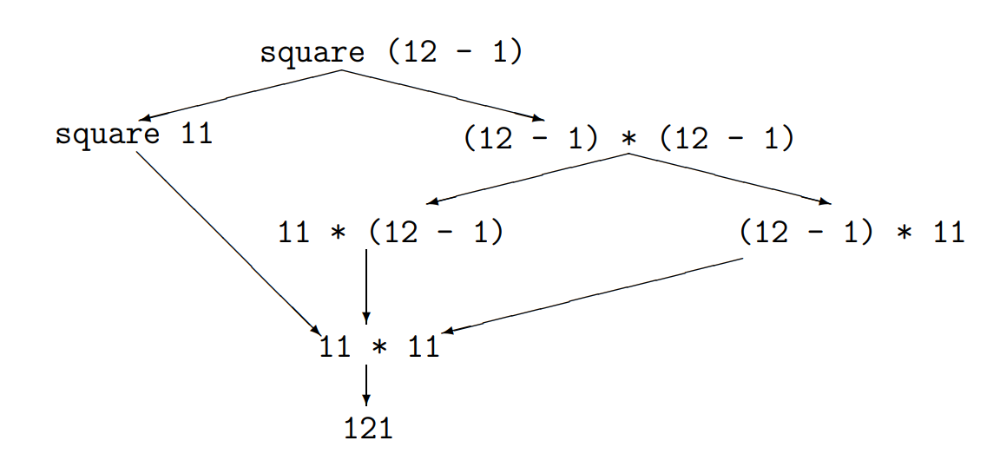

# Chapter 1: Introduction to the Functional Programming Language Haskell

In this chapter we give an introduction to the Haskell language. Here we will introduce the syntax of the language and informally explain the meaning of the language constructs. A formal definition of the semantics of the language follows in Chapter 2. For further descriptions of the Haskell language we refer to [Thi94, Bir98, Bir14, PJH98, Tho11, HPF00, Hud00, PJ00, Pep02]. More information about Haskell can be found on the Haskell homepage (<https://www.haskell.org>). The Haskell compiler and interpreter GHC is also available here within the *Haskell Platform*.

We first introduce the basic language constructs of Haskell in Section 1.1. We then go on to discuss functional programming techniques. To this end, in Section 1.2 we consider higher-order functions, i.e., functions that in turn process functions. In Section 1.3, we show how to program with lazy evaluation, using infinite data objects. Finally, in Section 1.4 we discuss the concept of monads, which are used in particular for input and output in Haskell.

## 1.1 Basic Language Constructs

In this section, we introduced the basic language constructs of Haskell (declarations, expressions, patterns, and types).

### 1.1.1 Declarations

A program in Haskell is a sequence of declarations. The declarations must be left-aligned. The reason for this will become clear later when we consider local declarations that are indented (or on the same line).

A declaration is (in the simplest case) a description of a function. Functions are characterized by a function symbol (the name of the function), the definition range, the value range of the result and a mapping rule. The definition range and the value range are specified in a so-called type declaration and the mapping rule is described in a function declaration. The syntax of declarations is therefore given by the following context-free grammar. [A declaration can be either a type declaration or a function declaration]

$\underline{\text{decl}} \rightarrow \underline{\text{typedecl}} \text{ | } \underline{\text{fundecl}}$

In the following, we will always indicate non-terminal symbols by underlining them. Furthermore, we will start with a subset of Haskell and extend the grammar rules successively. (We will not consider some programs allowed in the Haskell syntax - the complete grammar for Haskell programs can be found in [PJH98]).

Text enclosed between `{-` and `-}` and any text between `--` and the end of the line are considered comments in Haskell.

#### Type Declarations

Variable identifiers serve as function symbols in Haskell. For example, for a function that squares numbers, the name `square` can be used. A declaration binds a variable (like `square`) to a value (like the function that squares numbers). Then, one can specify the following type declaration for `square`.

```haskell
square :: Int -> Int
```

The first `Int` describes the definition range (domain) and the second `Int` describes the value range (range) of `square`. The type `Int` is predefined in Haskell. The declaration `var :: type` means that the variable `var` has the type `type`. With the help of "`->`" a function type is defined (i.e., `Int -> Int` is the type of functions that map integers into integers). As another example, `[Int]` describes the type of lists of integers. In general, for each type `a` there exists the type `[a]` of lists with elements of type `a`.

You get the following grammar rule for the syntax of type declarations. A type declaration specifies the type of one or more variables.

$\underline{\text{typedecl}} \rightarrow \underline{\text{var}}_1,\ldots,\underline{\text{var}}_n \text{ :: } \underline{\text{type}} \text{, for all } n \geq 1$

Type declarations do not have to be specified. They are then calculated automatically by the interpreter or compiler. However, type declarations are beneficial for the understandability of programs and should therefore normally be used. These declarations are then checked by the interpreter or compiler.

Variable identifiers `var` are arbitrary sequences of letters and numbers (strings) that start with a lowercase letter (such as `square`).

#### Function Declarations

The type declaration is followed by the defining equations, i.e. the mapping rule. For example, the function declaration for `square` could be as follows.

```haskell
square x = x * x
```

The left side of a defining equation consists of the name of the function and the description of the argument and the right side defines the result of the function. Here the types of the arguments and the results must naturally "fit" the type of the function (i.e., `square` may only get expressions of the type `Int` both as argument and as result). Basic arithmetic operations like `+`, `*`, `-`, `/`, etc. as well as comparison operations like `==` (for equality), `>=`, etc. are predefined in Haskell. The data structure `Bool` with the values `True` and `False` and the functions `not`, `&&` and `||` is also predefined. Libraries are used to define such frequently used functions. The functions mentioned above are defined in a standard library (the so-called "prelude"), which is loaded every time Haskell is started. In general, function declarations are structured as follows.

$\underline{\text{fundecl}} \rightarrow \underline{\text{funlhs}} \text{ } \underline{\text{rhs}}$

$\underline{\text{funlhs}} \rightarrow \underline{\text{var}} \text{ } \underline{\text{pat}}$

$\underline{\text{rhs}} \rightarrow \text{= } \underline{\text{exp}}$

Here `var` stands for the function name (like `square`) and `pat` for the argument on the left side of the defining equation (like `x`). How such arguments may look in the general case is explained in Section 1.1.3. The right side of a defining equation is an arbitrary expression `exp` (like `x * x`).

#### Exporting a Functional Program

The execution of a program consists of the evaluation of expressions. This is done similarly to a pocket calculator: The user enters an expression (with an interpreter) and the calculator evaluates it. For example, if you enter $42$, the result will be $42$. If you enter `6 * 7`, the result is also $42$, because the operation `*` is predefined. But in the same way the user-defined declarations are used for the evaluation. Thus, when `square 11` is entered, the result $121$ is obtained, and the same result is obtained when `square (12 - 1)` is entered. The binding priority of the function application is the highest here, i.e., if `square 12 - 1` is entered, $143$ is obtained.

The evaluation of an expression is done by term substitution in two steps:

  $(1)$ The computer searches for a subexpression that matches the left-hand side of a defining equation, replacing the variables of the left-hand side with suitable expressions. Such a partial expression is called a *Redex* (for "reducible expression").

  $(2)$ The Redex is replaced by the right-hand side of the defining equation, where the variables in the right-hand side must be assigned exactly as in $(1)$.

These evaluation steps are repeated until no more replacement step is possible.

In Fig. 1.1 all possibilities for the evaluation of the expression `square (12 - 1)` are shown. Each path through the diagram corresponds to a possible sequence of evaluation steps. An evaluation strategy is an algorithm for selecting the next Redex.


Figure 1.1: Evaluation of an expression

In particular, we distinguish between strict and non-strict evaluation. In strict evaluation, the leftmost innermost Redex in the expression is always chosen. This corresponds to the leftmost path through the diagram in Fig. 1.1. This strategy is also called leftmost innermost or call-by-value strategy or eager evaluation.

In the case of non-strict evaluation, the redex occurring furthest to the left in the expression is selected. The arguments of functions are now usually unevaluated expressions. This corresponds to the middle path through the diagram in Fig. 1.1. This strategy is also called leftmost outermost or call-by-name strategy.

Both strategies have advantages and disadvantages. In the non-strict evaluation, only the subexpressions whose value contributes to the final result are evaluated, which is not the case in the strict evaluation. On the other hand, the non-strict strategy sometimes has to evaluate the same value several times, although this is not necessary in the strict strategy (this happens here with the partial expression `12 - 1`).

Haskell follows the principle of the so-called lazy evaluation, which tries to combine both advantages. Here the non-strict evaluation is pursued, but duplicate partial expressions are not evaluated twice if they have arisen from the same origin term. In the above example, the partial term `12 - 1`, for example, was realized by a pointer to the same memory cell and thus evaluated only once.

Comparing the evaluation strategies, we get the following important result: If any evaluation strategy terminates, the non-strict evaluation also terminates (but not necessarily the strict evaluation). Moreover, it is true for all strategies: When the evaluation terminates, the result is the same regardless of the strategy. Thus, the strategies only affect the termination behavior, but not the result. As an example we consider the following functions.

```haskell
three :: Int -> Int
three x = 3

non_term :: Int -> Int
non_term x = non_term (x+1)
```

The evaluation of the function `non_term` does not terminate for any argument. The strict evaluation of the expression `three (non_term 0)` therefore also did not terminate. In Haskell, however, this expression evaluates to result $3$. We will learn more advantages of the non-strict strategy later in Section 1.3.

#### Conditional Defining Equations

Naturally, one also wants to use multi-digit functions and conditional defining equations. For this we consider a function `maxi` with the following type declaration.

```haskell
maxi :: (Int, Int) -> Int
```

Here `(Int, Int)` denotes the Cartesian product of the types `Int` and `Int` (this thus corresponds to the mathematical notation `Int × Int`). `(Int, Int) -> Int` is therefore the type of functions that map pairs of integers to integers. The function declaration of `maxi` is as follows.

```haskell
maxi(x, y) | x >= y    = x
           | otherwise = y
```

The expression on the right side of a defining equation can thus be restricted by a condition (i.e. an expression of the type `Bool`). For evaluation, one then uses the first equation whose condition is satisfied (but the case distinction in the equations need not be complete). The expression `otherwise` is a predefined function that always returns `True`. So the grammar rule for the formation of right sides of $\underline{\text{rhs}}$ defining equations must now be changed as follows:

$\underline{\text{rhs}} \rightarrow \text{= } \underline{\text{exp}} \text{ | } \underline{\text{condrhs}}_1 \ldots \underline{\text{condrhs}}_n \text{, where } n \geq 1$

$\underline{\text{condrhs}} \rightarrow \text{| } \underline{\text{exp}} \text{ = } \underline{\text{exp}}$

#### Currying

To reduce the number of parentheses in expressions (and thus improve readability), one often replaces tuples of arguments with a sequence of arguments. This technique is named after the logician *Haskell B. Curry*, whose first name was already used for the name of the programming language Haskell. To illustrate this, let us first consider a conventional definition of the function `plus`.

```haskell
plus :: (Int, Int) -> Int
plus (x, y) = x + y
```

Instead, the following definition could now be used:

```haskell
plus :: Int -> (Int -> Int)
plus x y = x + y
```

A transformation of the first definition of `plus` into the second is called *currying*. For the type `Int -> (Int -> Int)` one could also write more simply `Int -> Int -> Int`, because we use the convention that the function space constructor associates `->` to the right. The function application, on the other hand, associates to the left, i.e., the expression `plus 2 3` stands for `(plus 2) 3` (`(plus 2)` is a function that is applied to $3$).

Now `plus` gets two arguments one after the other. More precisely, `plus` is now a function that receives an integer `x` as input. The result is then the function `plus x`. This is a function from `Int` to `Int`, where `(plus x) y` calculates the addition of `x` and `y`.

Such functions can also be called with only one argument (this is also called *partial application*). For example, the function `plus 1` is the successor function which increases numbers by $1$ and `plus 0` is the identity function on integers. This possibility of application to a smaller number of arguments is (besides the saving of parentheses) the second advantage of currying. Altogether the grammar rule for left-hand sides of defining equations changes as follows:

$\underline{\text{funlhs}} \rightarrow \underline{\text{var}} \text{ } \underline{\text{pat}}_1 \ldots \underline{\text{pat}}_n \text{, where } n \geq 1$

#### Function Definition Through Pattern Matching

The arguments on the left side of a defining equation need not be variables in general, but they may be arbitrary patterns that serve as patterns for the expected value. Let us consider the function `und` (German for "and"), which calculates the conjunction of Boolean values.

```haskell
und :: Bool -> Bool -> Bool
und True  y = y
und False y = False
```

So, in particular, we now have multiple function declarations (i.e. defining equations) for the same function symbol.

Here, `True` and `False` are predefined data constructors of the `Bool` data type, i.e., they are used to construct the objects of this data type. Constructors in Haskell always begin with capital letters.

To determine which defining equation is to be applied to a function call `und` $\underline{\text{exp}}_1$ $\underline{\text{exp}}_2$, one tests in sequence from top to bottom which patterns match the current arguments $\underline{\text{exp}}_1$ and $\underline{\text{exp}}_2$ (this is called "matching"). So the question is whether there is a substitution that replaces the variables of the patterns with concrete expressions, so that, thereby, the instantiated patterns match $\underline{\text{exp}}_1$ and $\underline{\text{exp}}_2$. In this case, we also say that the pattern $\underline{\text{pat}}_i$ (at) "matches" the expression $\underline{\text{exp}}_i$. Then the total expression is evaluated to the corresponding instantiated right-hand side. So, for example, `und True True` evaluates to `True`, because in the substitution `[y/True]` the patterns `True` and `y` of the first defining equation match the current arguments `True` and `True`.

Since patterns are evaluated from top to bottom, the definition of `and` is equivalent to the following alternative declaration:

```haskell
und :: Bool -> Bool -> Bool
und True y = y
und x    y = False
```

When we have a function:

```haskell
unclear :: Int -> Bool
unclear x = not (unclear x)
```

whose evaluation does not terminate, the evaluation of `und False (unclear 0)` terminates anyway, because `unclear 0` does not have to be evaluated to perform pattern matching. On the other hand, `und (unclear 0) False` or `und True (unclear 0)` do not terminate.

In the `und` function, pattern matching succeeds because a value of type `Bool` can only be formed with the data constructors `True` or `False`. Boolean values are thus constructed using the following rule$^1$.

$^1$ The grammar rules for `Bool` and `[a]` are used here only to illustrate pattern matching and are not part of the Haskell language definition.

$\underline{\text{Bool} } \rightarrow \underline{ }$ $\texttt{True | False}$

However, pattern matching is also possible for other data types. To show how pattern matching can be used with lists, we again consider the algorithm `len`.

```haskell
len :: [a]  -> Int
len []       = 0
len (x : xs) = 1 + len xs
```

The predefined data structure of the lists has the data constructors `[]` and `:`, so that lists are formed as follows:

$\underline{\texttt{[a]}} \rightarrow \texttt{[] | \underline{a}:\underline{[a]}}$

Here `[]` stands for the empty list and the (infix) constructor "`:`" is used to build non-empty lists. As mentioned, the expression `x:xs` stands for the list `xs`, in which the element `x` was inserted in front. The element `x` here has a type `a` and `xs` is a list of elements of type `a`. (The grammar thus specifies how lists of type `[a]` are formed).

When evaluating `len [15,70,36]`, the list shorthand is first resolved. So the argument of `len` is `15:(70:(36:[]))`. Now pattern matching is performed starting with the first defining equation. The first data constructor `[]` does not match the constructor "`:`" used to form the current argument. But the pattern of the second defining equation matches this value, using the substitution $[$ `x/15, xs/70 (36:[])` $]$. So this expression evaluates in the first step to `1 + len (70:(36:[]))`, etc.

Analogously, one could also define the following algorithm:

```haskell
second :: [Int]  -> Int
second []           = 0
second (x : [])     = 0
second (x : y : xs) = y
```

One may also use the list shorthand notation in these patterns and replace the second equation by `second [x] = 0`. It should be mentioned that in Haskell no completeness of the defining equations is required.

#### Pattern Declarations

Not only functions, but also other values can be specified in declarations:

```haskell
pin :: Float
pin = 3.14159

suc :: Int -> Int
suc = plus 1

x0, y0 :: Int
(x0,y0) = (1,2)

x1, y1 :: Int
[x1,y1] = [1,2]

x2 :: Int
y2 :: [Int]
x2:y2 = [1,2]
```

Here `float` is the predefined type for floating point numbers.

In general, an expression may be assigned to any pattern. In the simplest case, a pattern is a variable. Otherwise it is an expression such as `(x0, y0)`, so that when a value such as `(1,2)` is assigned to this expression, it is clear which values are assigned to the individual variable identifiers. A pattern binding may occur only once for each identifier (whereas function bindings may occur multiple times - with different patterns for the arguments).

So we now extend the possibilities for declarations $\underline{\text{decl}}$ with pattern declarations as follows:

$\underline{\text{decl}} \rightarrow \underline{\text{typedecl}} \text{ | } \underline{\text{fundecl}} \text{ | } \underline{\text{patdecl}}$

$\underline{\text{patdecl}} \rightarrow \underline{\text{pat}} \text{ } \underline{\text{rhs}}$

#### Local Declarations

Local declarations are used to create another local declaration block within a declaration. In each right-hand side of a function or pattern declaration, you can specify a sequence of local declarations after the `where` keyword, which refer only to this right-hand side. External declarations of the same identifier are covered by the local declaration. The grammar rules for $\underline{\text{fundecl}}$ and $\underline{\text{patdecl}}$ are therefore changed as follows. Here, square brackets in the grammar mean that the expressions inside are optional.

$\underline{\text{fundecl}} \rightarrow \underline{\text{funlhs}} \text{ } \underline{\text{rhs}} \text{ } [\texttt{where } \underline{\text{decls}}]$

$\underline{\text{patdecl}} \rightarrow \underline{\text{pat}} \text{ } \underline{\text{rhs}} \text{ } [\texttt{where } \underline{\text{decls}}]$

$\underline{\text{decls}} \rightarrow \{ \underline{\text{decl}}_1; \ldots; \underline{\text{decl}}_n\} \text{, where } n \geq 0$

As an example, consider the following program that calculates the solutions of a quadratic equation using the following formula:

$ax^2 + bx + c = 0 \iff x = \frac{-b \pm \sqrt{b^2 - 4ac}}{2a}$

```haskell
roots :: Float -> Float -> Float -> (Float, Float)
roots a b c = ((-b - d)/e, (-b + d)/e)
              where { d = sqrt (b*b - 4*a*c); e = 2*a }
```

An important advantage of local declarations is that the values declared in them are computed only once. The call to `roots 1 5 3` therefore generates a graph

```haskell
((-5 - ^d)/ ^e, (-5 + ^d)/ ^e),
```

where `^d` is a pointer to a memory cell with the expression `sqrt (5*5 - 4*1*3)` and `^e` is a pointer to `2*1`. So these two expressions have to be evaluated only once and you can avoid multiple evaluations of the same expressions.

To avoid parentheses and to increase readability, Haskell has the so-called *Offside-Rule* for writing (local) declarations:

$1.$ The first symbol in a $\underline{\text{decls}}$ collection of declarations determines the left margin of the declaration block.

$2.$ A new line that starts at this left margin is a new declaration in this block.

$3.$ A new line that starts further to the right than this left margin belongs to the same declaration (i.e., it is the continuation of the line above). For example,

```haskell
d = sqrt (b*b - 
          4*a*c)
```

for

```haskell
d = sqrt (b*b - 4*a*c)
```

$4.$ A new line starting further to the left than the left margin means that the $\underline{\text{decls}}$ block is finished and it is no longer part of this collection of declarations.

So $\underline{\text{decls}}$ can also be written like an indented program (i.e., as a sequence of declarations that are left-bundled below each other). For example, the declaration of roots could also be written as follows:

```haskell
roots a b c = ((-b - d)/e, (-b + d)/e)
              where d = sqrt (b*b - 4*a*c)
                    e = 2*a 
```

#### Operators and Infix Declarations

Some functions should be used in infix not prefix notation to increase the readability of programs. Examples are `+, *, ==` or the list constructor `:` which is used to insert elements into lists. Such function symbols are called *operators*. As with the prefix symbols, a distinction is made between variables and constructors. The latter do not receive a function declaration, but are used to represent objects of a data structure. Operators are represented in Haskell by sequences of special characters. Constructor operators (like `:`) start with a colon and variable operators (like `+` or `==`) start with another character.
